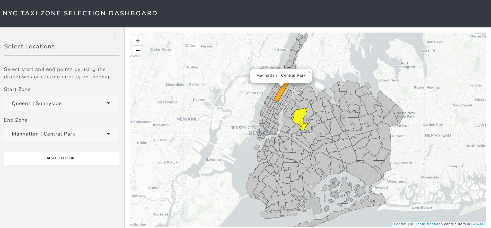

# NYC Taxi Zone Selection Dashboard  
*A Geospatial Shiny App for NYC Taxi Route Exploration*

**Author:** Angel Feliz  
**License:** [GNU GPL v3.0](https://www.gnu.org/licenses/gpl-3.0.html)  

## 📍 Project Overview
This interactive Shiny application provides a geographic tool to explore and select NYC Taxi Zones within the boroughs of Manhattan, Queens, and Brooklyn. Users can intuitively select start and end taxi zones via dropdowns or by directly interacting with a dynamic Leaflet map.

Designed for exploratory analysis, this app demonstrates route selection, spatial highlighting, and user interactivity using R's geospatial stack.

## 🌐 Live Demo
Try the app in your browser: [NYC Taxi Zone Selector on Hugging Face Spaces](https://huggingface.co/spaces/AngelFelizR/nyc-taxi-zone-selector)

## 🖼️ App Screenshot


## 🎯 Key Features
- **Interactive Map** with real-time zone highlighting
- **Geospatial Processing** using `sf`
- **Responsive UI** styled with Bootstrap 5 (`bslib`)
- **Click & Select Mechanism** for map zones
- **Zone Merge Logic** for geometry corrections (e.g., Corona)

## 💡 Technical Highlights
- **CRS Standardization** to EPSG:4326 for web maps
- **Geometry Union** with `st_union()` for duplicate handling
- **Reactive State Logic** with `reactiveValues()`
- **Custom Map Layers** for zone roles: yellow (start), orange (end)

## 📦 Built With
| Package   | Description                                |
|-----------|--------------------------------------------|
| `shiny`   | Web framework for R                        |
| `leaflet` | Interactive mapping                        |
| `sf`      | Simple Features for spatial data           |
| `bslib`   | Bootstrap theming in Shiny                 |

## 📁 Folder Structure
```text
.
├── app.R                      # Main Shiny application
├── screenshot-ui.png          # Application UI preview
├── taxi_zones/
│   └── taxi_zones.shp         # NYC Taxi Zone shapefile (and related files)
├── LICENSE.md                 # GNU GPL v3.0 license
├── nyc-taxi-zone-selector.Rproj
├── renv/                      # R environment folder
└── renv.lock                  # Dependency lockfile
```

## 🚀 Getting Started
1. Install dependencies:
```r
install.packages(c("shiny", "bslib", "sf", "leaflet"))
```
2. Place the `taxi_zones.shp` files in the `taxi_zones/` folder.
3. Launch the app:
```r
shiny::runApp("app.R")
```

## 🧭 Use Case Potential
- 🚕 Taxi Fare Estimation  
- 📊 Demand Forecasting by Zone  
- 🗺️ Urban Mobility Planning  
- 🧠 Geospatial Feature Engineering

## 📜 License
This project is licensed under the GNU General Public License v3.0.  
See the full license [here](https://www.gnu.org/licenses/gpl-3.0.html).